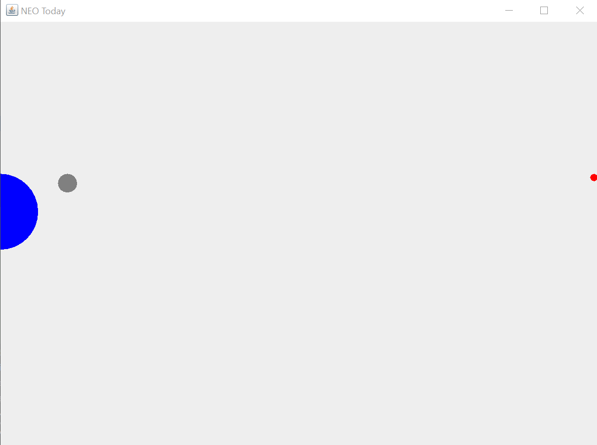

#NASA NEO API Display

This is a test application I wrote in MCO-152 to apply knowledge of:

* APIs
* JSON
* [Retrofit](https://square.github.io/retrofit/)
* Guice
* Gson
* Gradle
* Mockito
* Model-View-Controller
* Factory pattern

This displays the [Near Earth Object](https://api.nasa.gov/) data from NASA

